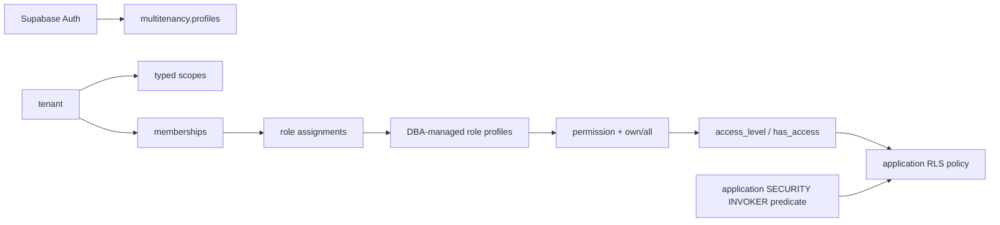

# Architecture

## Boundary

`multitenancy` owns identity projections, tenants, scopes, memberships, roles, permissions, assignments, invitations, settings, and audit events. Consumer projects own their business tables and row-specific authorization predicates. All package tables, triggers, helper functions, and RPC entrypoints reside strictly inside the `multitenancy` schema, keeping the `public` schema unpolluted.

## Authorization model

Each `role_permissions` row contains a permission key and `access_level`:

- `own`: access only when the consumer application's policy owner check or custom predicate passes.
- `all`: access to every matching tenant/scope row.

`multitenancy.access_level()` reads live database state and returns `none`, `own`, or `all`. Multiple roles union by taking the strongest grant. Multiple requested scopes intersect by taking the weakest covered scope. A missing, foreign, or uncovered scope returns `none`.

`multitenancy.has_access()` compares the effective level with a required level. `multitenancy.authorize()` remains as a compatibility helper and means “at least own.”

## Why custom checks are application-owned

Tenant-controlled function names are code pointers. Executing one inside a generic `SECURITY DEFINER` helper would let tenant data choose code that runs with the helper owner's privileges. This package therefore stores no function name, owner-column name, or row JSON in RBAC tables.

The consumer writes a schema-qualified direct call in a reviewed application migration. PostgreSQL resolves that function when the migration is applied, and it runs as `SECURITY INVOKER`. This makes custom behavior reviewable in source control and keeps privileged package helpers row-agnostic.

## RLS generation

The provided `protect_table.sql` template demonstrates one policy per CRUD operation with an `all` branch and an `own` branch. `UPDATE` gets both `USING` and `WITH CHECK`. A trigger makes the tenant and optional scope columns immutable so a user with access to two tenants cannot move a row between them.

Scoped tables receive a composite foreign key `(tenant_id, scope_id) -> multitenancy.scopes(tenant_id, id)`. This makes scope ownership a database invariant instead of a policy convention.

## Administrative model

Roles and role permissions are defined only by the database owner through reviewed migrations. They have no public mutation RPC. Tenant owners may manage ownership and assign the existing role profiles; package permissions may delegate member, invitation, scope, and audit operations. Grant and invitation commands enforce anti-escalation using both the permission key and required `access_level` at the exact target scope.

## Invitations

Invitation creation stores a SHA-256 token hash and returns the raw 256-bit token once. The hash is retained after acceptance or revocation so terminal states can be reported and acceptance is idempotent for the accepting user. Resend rotates the token. Acceptance locks the invitation row and applies grants atomically.

## Versioning

The ordered source migrations are combined into `sql/install.sql` as a release artifact. Consumers vendor that SQL into a normal Supabase migration and own its migration history. Future package releases must add append-only upgrade SQL; they must never rewrite an already published migration. Version 0.2 is pre-release and rewrites the initial 0.1 draft, so disposable 0.1 installations should be reset rather than mixed with this baseline.

## SDK boundary

The TypeScript and Python SDKs contain no authorization state and no privileged credentials. They validate the RPC envelope, map stable database errors, and expose convenience methods. Role catalogs are read-only in both SDKs. RLS and RPC authorization remain authoritative if an SDK is bypassed.
