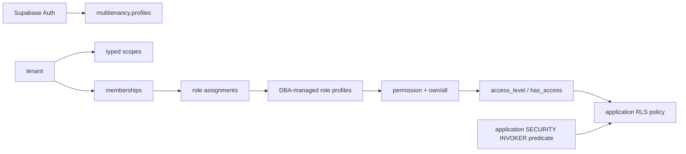

# Architecture

## Boundary

`multitenancy` owns identity projections, tenants, scopes, memberships, roles, permissions, assignments, invitations, settings, and audit events. Consumer projects own their business tables and row-specific authorization predicates. Package tables and implementation remain private in `multitenancy`; thin fixed-search-path RPC and RLS-helper wrappers are exposed through `api`.

## Authorization model

Each `role_permissions` row contains a permission key and `access_level`:

- `own`: access only when the consumer application's policy owner check or custom predicate passes.
- `all`: access to every matching tenant/scope row.

`api.access_level()` reads live database state and returns `none`, `own`, or `all`. Multiple roles union by taking the strongest grant. Multiple requested scopes intersect by taking the weakest covered scope. A missing, foreign, or uncovered scope returns `none`.

`api.has_access()` compares the effective level with a required level. `api.authorize()` means “at least own.”

## Why custom checks are application-owned

Tenant-controlled function names are code pointers. Executing one inside a generic `SECURITY DEFINER` helper would let tenant data choose code that runs with the helper owner's privileges. This package therefore stores no function name, owner-column name, or row JSON in RBAC tables.

The consumer writes a schema-qualified direct call in a reviewed application migration. PostgreSQL resolves that function when the migration is applied, and it runs as `SECURITY INVOKER`. This makes custom behavior reviewable in source control and keeps privileged package helpers row-agnostic.

## RLS generation

The provided `protect_table.sql` template demonstrates one policy per CRUD operation with an `all` branch and an `own` branch. `UPDATE` gets both `USING` and `WITH CHECK`. A trigger makes the tenant and optional scope columns immutable so a user with access to two tenants cannot move a row between them.

Scoped tables receive a composite foreign key `(tenant_id, scope_id) -> multitenancy.scopes(tenant_id, id)`. This makes scope ownership a database invariant instead of a policy convention.

## Administrative model

Roles and role permissions are defined only by the database owner through reviewed DBA migrations (`sql/templates/roles.sql`). A NULL `roles.tenant_id` creates a global catalog role; a non-NULL value creates a rare tenant-specific role. Neither has a public mutation RPC.

Tenant owners and delegated managers (`multitenancy.members.manage`) manage team memberships and assign existing role profiles to users via `mt.members.setGrants` or `mt.invitations.create`. 

### Anti-Escalation Protection
When a delegated manager attempts to assign a role or create an invitation with grants, the database executes an anti-escalation verification:
- For every permission in the target role, the database verifies that the actor currently holds `has_access()` with an equal or stronger `access_level` at that exact `scope_id`.
- If the actor attempts to grant a permission or scope they do not personally hold, PostgreSQL raises exception `ROLE_ESCALATION (42501)`.
- This ensures that delegated project managers cannot grant cross-project access or elevate members to root managers.

## Invitations

Invitation creation stores a SHA-256 token hash and returns the raw 256-bit token once. The hash is retained after acceptance or revocation so terminal states can be reported and acceptance is idempotent for the accepting user. Resend rotates the token. Acceptance locks the invitation row and applies grants atomically.

## Modular Migration Pipeline

The package is partitioned into 16 focused, maintainable migrations (each under 250 lines):

1. **`001_base.sql`**: Base private schema `multitenancy`, settings, and version metadata.
2. **`002_identities.sql`**: Profiles, tenants, scopes, memberships, and auth triggers.
3. **`003_rbac.sql`**: Permission catalog, DBA-managed role definitions, and role assignments.
4. **`004_invitations.sql`**: Invitation records, invitation grants, and cross-tenant integrity trigger.
5. **`005_audit.sql`**: Append-only audit trail and mutation-blocking trigger.
6. **`006_authorize.sql`**: Access level calculation (`access_level`), evaluation (`has_access`, `authorize`), and key immutability trigger.
7. **`007_rpc_tenant.sql`**: Client self-service tenant provisioning and UI capability checker (`can`).
8. **`008_rpc_cursor.sql`**: URL-safe Base64 token serialization and validation for keyset pagination.
9. **`009_rpc_context.sql`**: Paginated metadata discovery (`context_page`) and active tenant context (`context`).
10. **`010_rpc_invitations.sql`**: Token inspection (`invitation_preview`) and atomic acceptance (`accept_invitation`).
11. **`011_admin_tenant.sql`**: Private tenant lifecycle, naming, and ownership transfer handlers.
12. **`012_admin_scope.sql`**: Private scope management handlers (create, update, delete).
13. **`013_admin_member.sql`**: Member grant updates, suspension, reactivation, and removal.
14. **`014_admin_invitation.sql`**: Invitation generation, resending, and revocation handlers.
15. **`015_admin_router.sql`**: Grant reference validation (`validate_grants`) and central `multitenancy.admin` dispatcher.
16. **`016_api_boundary.sql`**: Public `api` schema, safe SQL wrappers, schema permission lockdown, and version stamp.

---

## Performance Characteristics

All core security routines are marked `STABLE SECURITY DEFINER` with fixed `search_path = ''`:
- **Query Optimizer Inlining**: PostgreSQL optimizes multiple calls within a single query plan, preventing $N+1$ function execution loops.
- **Index-Covered Traversal**: Composite indexes on `(tenant_id, membership_id, scope_id)` allow PostgreSQL to resolve `access_level` in sub-millisecond time ($<0.035\text{ ms}$).
- **RLS Overhead**: Adds less than $0.001\text{ ms}$ ($1\ \mu\text{s}$) over unconstrained raw queries on tables with 100,000+ rows.

---

## Versioning

The ordered source migrations are combined into `sql/install.sql` as the v0.3 fresh baseline. Consumers vendor that SQL into a normal Supabase migration and own its migration history. This pre-production release does not provide a v0.2 upgrade path; reset disposable older installs before reinstalling.

## SDK boundary

The TypeScript and Python SDKs contain no authorization state and no privileged credentials. They validate the RPC envelope, map stable database errors, and expose convenience methods. Role catalogs are read-only in both SDKs. RLS and RPC authorization remain authoritative if an SDK is bypassed.
